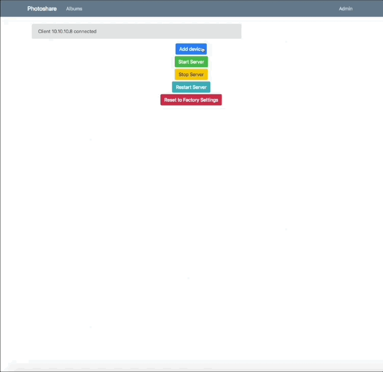

# Photoshare

  

Python 3.7 Application to store, view and serve photos to [iOS Client](https://github.com/marcus604/PhotoshareiOS)

  

# Demo

  

## View Photos

  

Photos are shown in chronological order and can be organized into albums.

  


  

## Admin Panel

  

Shows IP of any connected device.

  

Devices must be added before they can connect.

  

Passwords are salted and hashed using argon2

  



  

# Usage

  

Instructions written and tested on Ubuntu Desktop 18.04 but should be easily adapted to work on other distros, Windows, and macOS.

  

### Install System Dependencies

  

```
sudo apt install python3.7 python3.7-venv python3-dev python3-venv
sudo apt install mysql-server supervisor nginx git
```

  

### Setup mysql

  

`sudo mysql_secure_installation`

  

### Setup DB and account

  

`sudo mysql`

  

```sql
CREATE  DATABASE photoshare COLLATE utf8_general_ci;

CREATE USER 'photoshare'@'localhost' IDENTIFIED BY  'photoshareSQLPassword';

grant all privileges on photoshare.* to  'photoshare'@'localhost';

flush privileges;
```

  

### Clone repository

  

`git clone https://github.com/marcus604/Photoshare`

  

### Create necessary directories

```
cd Photoshare/
mkdir Library
mkdir Library/tmp
mkdir Library/photos
mkdir Library/import
mkdir certs
mkdir logs
```

  

### Setup Python environment

```
python -m venv venv
source venv/bin/activate
pip install --upgrade pip
pip install gunicorn pymysql
pip install -r requirements.txt
```

  

### Edit settings.ini for your machine/environment

  

### Create certificates

```
openssl genrsa -des3 -out certs/server.key 1024
openssl req -new -key certs/server.key -out certs/server.csr

cp certs/server.key certs/server.key.org

openssl rsa -in certs/server.key.org -out certs/server.key

openssl x509 -req -days 365 -in certs/server.csr -signkey certs/server.key -out certs/server.crt
```

  
  

#### Create gunicorn instance

  

`gunicorn -b localhost:5000 -w 1 photoshare:app`